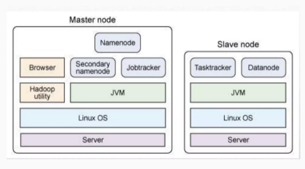

# Hadoop e o Processamento Distribuído

- Hadoop é uma Framework Java mantido pela Fundação Apache
- Solução open-source para trabalhar com big data
- Criado em 2005 com apoio de grandes empresas como Yahoo
  
## Funcionalidades

- Desenvolvimento de Aplicações distribuídas
- Processamento de grandes volumes de dados

## Utilização

- Indicado para organizações que necessitem de análise de grandes volumes de dados;
- Áreas 
  - Astronomia
  - Pesquisas Científicas
  - Meteorologia
  - Redes Socias
  - Buscadores
  - Mercado Financeiro
  - E-commerce

## Benefícios

- Redução de custos
- Boa documentação
- Comunidade ativa
- Adesão por parte de grandes empresas

## Estruturação

- Hadoop Common
- Hadoop Distribuition File System (HDFS)
- Hadoop MapReduce

## Pipeline de execução

- Carregar os dados do HDFS
- Realizar as operações MapReduce
- Recuperar os resultados no HDFS

## HDFS

- Principal tarefa: Armazenamento de dados
- É um sistema de arquivos do Hadoop
- Divide os arquivos e os replica para diferentes máquinas do cluster
- Desenvolvimento em Java
- Poder ser executado em máquinas com hardwares comuns
- Funciona sob o modelo master/works

### Namenode

- É o master
- Gerencia o sistema de arquivos e o acesso a eles
  - Conhece todos os Datanodes e onde se encontra pedaços de um determinado arquivo
- Representa o JobTracker, serviço que delega e monitora o status das tarefas
  - Permite re-execução de tarefas que falharam

A imagem a seguir demonstra o que é o Hadoop

- O armazenamento de dados é feito em blocos de 128MB sempre

### ETL
- Coletar, processar e gerar resultado

Onde a fase de ETL é realizada?
  - A Namenode
  - B Datanode
  - C MapReduce (Correta)

- Nunca levar o dado para o processamento, mas sim levar o processamento para o dado
- 

Observações: NoSql -> Performance de leitura